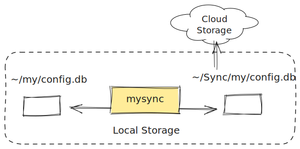

|ruff|

********************
mysync
********************

``mysync`` is a light-weight file synchronization tool for Python. It uses ``watchdog`` to
monitor pairs of files and runs `unison`_ to keep them synchronized upon change.

To illustrate an intended use case, consider a configuration file at *~/my/config.db*. We
actually want to store this in a shared directory named *~/Sync/*, so that the files in it
can be shared across different machines. We typically use symbolic links in this case,
such that the symlink *~/my/config.db* targets *~/Sync/my/config.db*. Some application,
however, do not follow symbolic links and instead overwrite with regular files, destroying
the links. ``mysync`` is a microserver who watches the pairs of files for file
modification events and synchronizes to their up-to-date version. This way, we do not rely
on symbolic links.

Installation
============

Install ``mysync`` from this repository:

.. code-block:: sh

    pip install git+https://github.com/okomestudio/mysync.git

The installation procedure for ``unison`` varies for different systems; see its
documentation.

How to Use
==========

.. code-block:: sh

    $ python -m mysync -l ~/my/config.db ~/Sync/my/config.db

Repeat the ``-l`` argument for all pairs of files to be watched for change.

Since ``mysync`` is a service, it should be managed through a process control system such
as ``systemd`` and ``supervisor``.

.. _unison: https://github.com/bcpierce00/unison

.. |ruff| image:: https://img.shields.io/endpoint?url=https://raw.githubusercontent.com/astral-sh/ruff/main/assets/badge/v2.json
   :target: https://github.com/astral-sh/ruff
   :alt: Ruff
